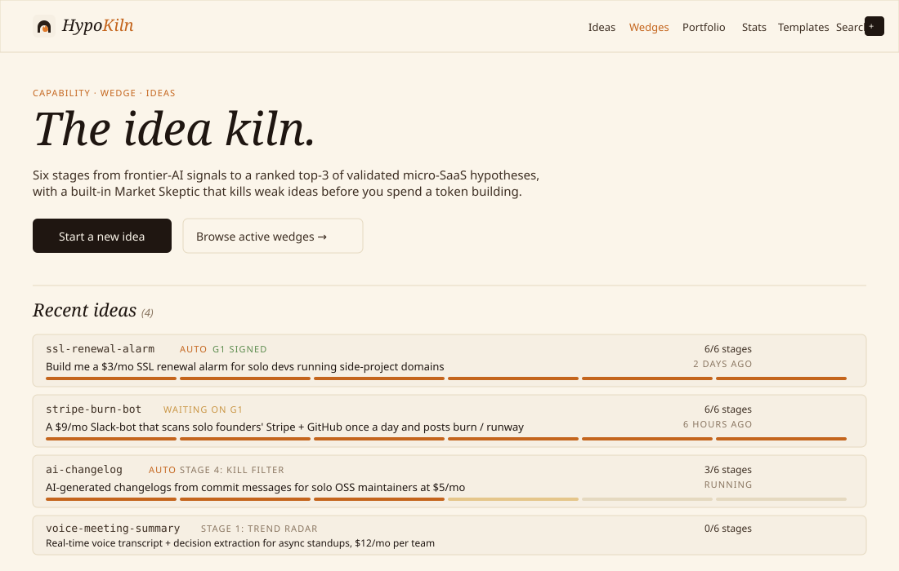
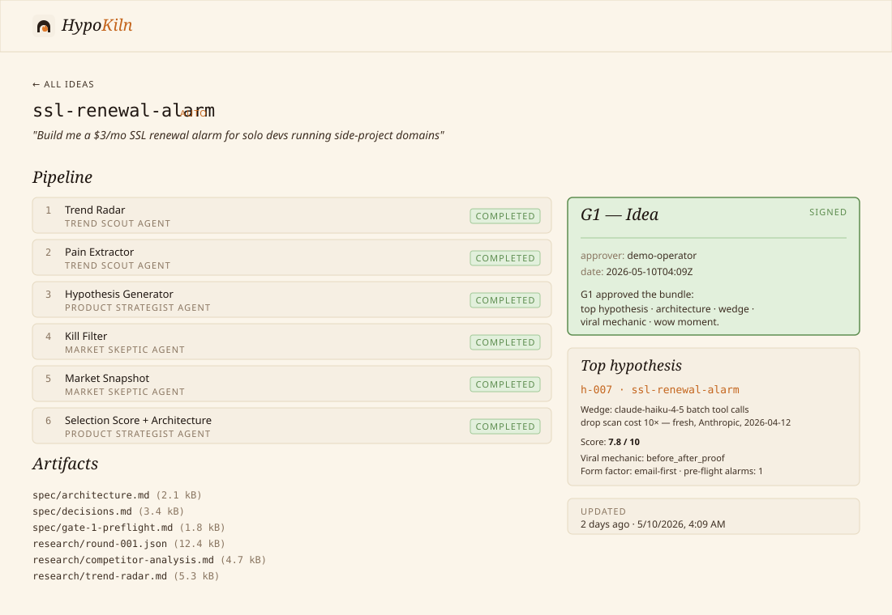
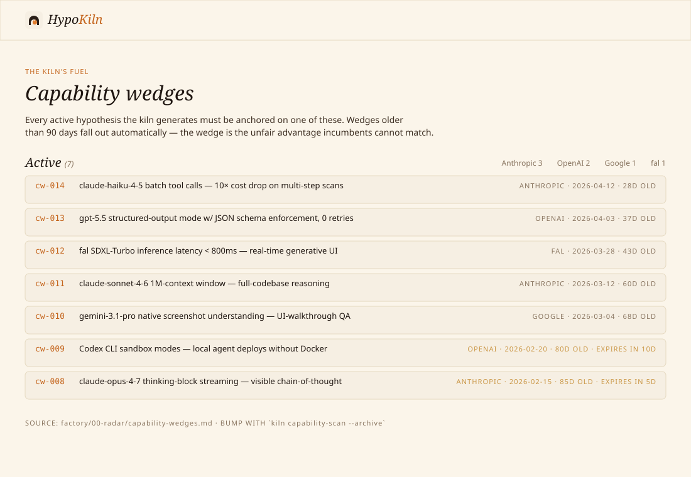
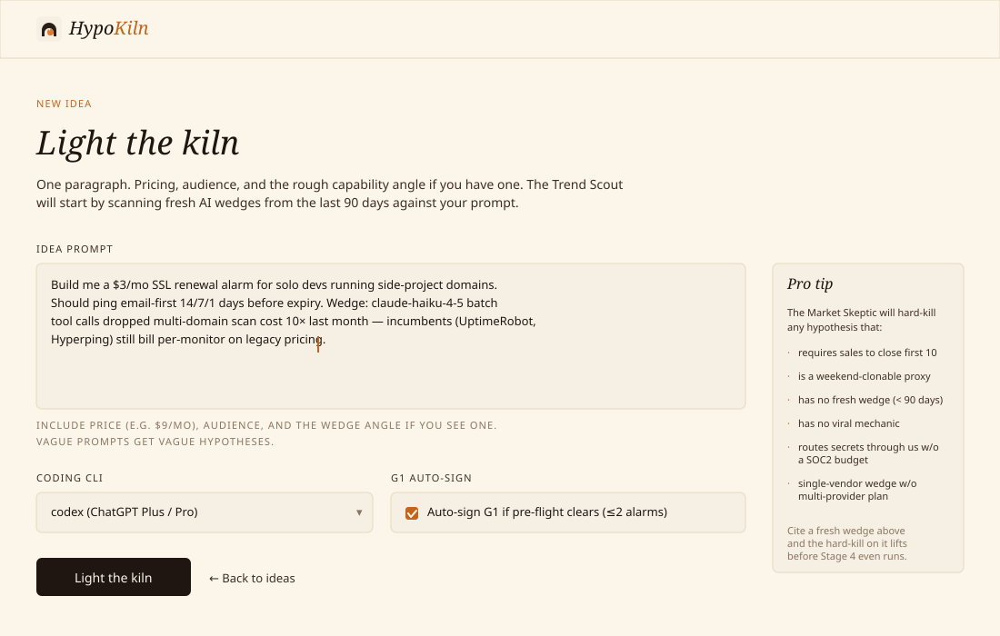

<div align="center">

<picture>
  <source media="(prefers-color-scheme: dark)" srcset="docs/logo-dark.svg">
  <source media="(prefers-color-scheme: light)" srcset="docs/logo-light.svg">
  
</picture>

### The idea kiln.

**Type a paragraph. Six stages later, you have three validated micro-SaaS hypotheses that survived a hard kill filter and a Market Skeptic.** Every survivor is anchored on a capability wedge less than 90 days old — incumbents haven't shipped against it yet.

<br>

[](#one-line-install) [](web/) [](tests/) [](LICENSE)

```bash
./install.sh && make dev
```

That's it. One command sets up the venv, installs deps, seeds demo runs, and tells you what to open.

<br>



</div>

---

## Why this exists

Most AI idea generators are slot machines: pull lever, get fifty plausible-sounding hypotheses, half of which die in week one because they were built on yesterday's capabilities or land in a red ocean. **HypoKiln is the opposite of a slot machine.** It refuses to generate an idea unless:

- It can name a specific AI capability that shipped in the last 90 days and unlocks the wedge. *"AI-powered"* is rejected. *"claude-haiku-4-5 batch tool calls drop scan cost 10× — Anthropic, 2026-04-12"* is accepted.
- A Market Skeptic agent has run **13 named hard-kills** against it (trust-MITM without compliance budget, weekend-clonable proxy, single-vendor killshot, freemium overlap, viral-mechanic embarrasses paying ICP, vaporware wedge, …) and a **5-persona mortality stress test** (CISO, VC, Month-6 Customer, Regulator, Incumbent CEO).
- It survives three deterministic structural audits (signals dated + URL'd + multi-source · hypotheses non-template + role+segment'd · market snapshot grounded in real competitor URLs + price tokens).
- A 10-question pre-flight checklist has fewer than three `alarm` verdicts.

Most ideas die for one of these named reasons. Surfacing the failure at idea-time costs you a 30-minute run. Surfacing it at month six costs you the runway.

---

## How it works



Six stages. One human gate. No deploy, no build, no bullshit — the kiln stops where the highest-leverage decision lives.

| # | Stage | Owned by | Critique loop |
|---|---|---|---|
| 1 | **Trend Radar** | Trend Scout | ↻ `trend-radar-audit` × Market Skeptic critic |
| 2 | Pain Extractor | Trend Scout | |
| 3 | **Hypothesis Generator** | Product Strategist | ↻ `hypothesis-audit` × Market Skeptic critic |
| 4 | Kill Filter | Market Skeptic | 13 hard-kills + 5-persona stress test |
| 5 | **Market Snapshot** | Market Skeptic | ↻ `market-snapshot-audit` × Product Strategist critic |
| 6 | Selection Score + Architecture + Pre-flight | Product Strategist | |
| | **G1 — Idea** | *human (or `--yolo` if pre-flight ≤2 alarms)* | |

Three of those stages run under a critique loop: author drafts → deterministic gate runs → if FAIL, a critic agent writes a structured `.critique-log/stage-N.feedback.md` → author iterates. Up to three rounds. The author can't pass the stage by sounding confident — only by passing the gate.

---

## The capability radar

This is the part that doesn't exist in any other idea tool I've seen, and it's the thing that actually moves the needle.



`factory/00-radar/capability-wedges.md` is a canonical log of AI/LLM/media releases from the last 90 days. Each entry has a wedge type (new endpoint · new model class · price drop ≥10× · latency crossed · new modality combo), a primary-source URL (no aggregators), a release date, and 3-5 product hypotheses it unlocks. Wedges older than 90 days get archived automatically (`kiln capability-scan --archive`).

**Stage 4's Kill Filter hard-kills any hypothesis whose `capability_wedge.id` isn't on the active list, isn't fresh, or doesn't have a primary-source URL.** No wedge → no idea. This is what makes the kiln's output different from "ChatGPT spitballed twenty SaaS ideas at me."

---

## One-line install

```bash
./install.sh
```

That single command:

1. Checks Python 3.12+ and Node 20+
2. Detects which coding CLI you have logged in (codex / claude / gemini)
3. Creates `.venv/` and installs the orchestrator, CLI, audits, and the FastAPI control plane
4. `npm install` in `web/`
5. Copies `.env.example` → `.env`
6. Seeds four demo ideas at different pipeline stages so the dashboard isn't empty
7. Tells you what to run next

After it finishes:

```bash
make dev
```

FastAPI on `:8765`, Next.js dashboard on `:3000`. Open the browser, click around — the demo data is fake but every page renders against the same code paths the real kiln uses.

For the real thing:

```bash
codex login                                      # log in once
kiln build "Your idea here" --yolo               # six stages, ~30 minutes, G1 auto-signs if pre-flight clears
```

---

## Bring your own coding CLI

HypoKiln never talks to provider APIs directly. Each stage spawns a logged-in **coding CLI** as a subprocess; auth lives in the CLI's session file, not ours. HypoKiln cannot read your token even if it wanted to.

| Binary | Login | Plan needed |
|--------|-------|-------------|
| `codex`  | `codex login`        | ChatGPT Plus / Pro / Team |
| `claude` | `claude` → `/login`  | Claude.ai Pro / Team      |
| `gemini` | `gemini auth`        | Google AI Studio account  |

The kiln runs on the subscription you already pay for. No API keys, no per-token billing surprises, no key-rotation paranoia.

---

## Start a new idea



One paragraph. The form lints it before you spend a token: price stated? audience named? a wedge angle hinted at? Vague prompts get vague hypotheses — the form tells you that.

---

## What lands in `products/<slug>/`

```
products/<slug>/
├── research/
│   ├── trend-radar.md            10+ dated signals with URLs, 3+ distinct sources
│   ├── round-001.json            10+ hypotheses, each with capability_wedge + viral_mechanic
│   ├── market-snapshot.md        why now + recent-date evidence
│   ├── competitor-analysis.md    3+ named competitors with URLs and moat-depth scores
│   └── pricing-research.md       2+ price tokens, willingness-to-pay quotes
├── spec/
│   ├── decisions.md              append-only cross-stage memory log
│   ├── architecture.md           form_factor + archetype + wow_moment + viral_mechanic
│   ├── gate-1-preflight.md       10-question alarm-count checklist
│   └── gate-1-approval.md        signed (or rejected) verdict
└── .critique-log/                per-iteration transcripts + critic feedback
```

Everything is markdown or JSON. Nothing is hidden in a database. You can `cat` your way through any run.

---

## The CLI

```bash
kiln build "<free-text prompt>"   [--slug <kebab>] [--yolo] [--dry-run]
                                  [--cli-bin codex|claude|gemini]
                                  [--only-stage N]... [--skip-stage N]...
kiln resume <slug>                pick up a paused pipeline
kiln status [<slug>]              one-line summary of every run
kiln capability-scan              [--archive] [--max-age-days 90]
kiln skills list|update|clean     manage attached skill packs

# Deterministic stage gates — exit 0 on PASS, 1 on FAIL.
# Useful by hand; also called automatically by the critique loop.
kiln trend-radar-audit       <slug>     # T1–T5
kiln hypothesis-audit        <slug>     # H1–H5
kiln market-snapshot-audit   <slug>     # M1–M5
```

---

## The dashboard

The web UI is a thin layer on top of the same file-on-disk state the CLI uses. Start a run from the terminal, sign G1 from the browser — the state files are the single source of truth.

| Route | What's there |
|---|---|
| `/` | All ideas with per-stage progress, status, current owner |
| `/runs/new` | Idea form with pro-tip sidebar (the 6 hardest kill conditions) |
| `/runs/<slug>` | Six-stage detail, live SSE updates, artifact viewer, G1 sign card |
| `/wedges` | Browse the capability log: active, archived, expiring soon |
| `/portfolio` | Every idea on one timeline |
| `/stats` | Success rate, per-stage durations, failure heatmap |
| `/templates` | Save winning prompts as one-click presets |
| `/search` | Cross-run grep across prompts + research + spec + logs |

---

## Architecture

```
┌──────────────────┐  spawns  ┌────────────────────┐  reads/writes  ┌──────────────────────┐
│  CLI / cron      │ ───────▶ │  hypokiln/          │ ◀────────────▶ │  .hypokiln/state/    │
│  kiln build      │          │  - pipeline.py      │                │  <slug>/state.json   │
│                  │          │  - gates.py         │                │  <slug>/logs/*.log   │
│                  │          │  - runners/         │                │  products/<slug>/    │
└──────────────────┘          │  - skill_loader.py  │                │   spec/gate-1-*.md   │
                              └────────────────────┘                │   research/*         │
┌──────────────────┐  HTTP    ┌────────────────────┐                │   .critique-log/*    │
│  web/ (Next.js)  │ ───────▶ │  control/ (FastAPI)│                └──────────────────────┘
│  dashboard       │ ◀── SSE ─│                    │
│  http://:3000    │          │                    │
└──────────────────┘          └────────────────────┘
```

The control plane never owns state — the orchestrator does. The web UI never spawns the orchestrator directly — it asks the control plane to. The CLI works without either.

---

## Quality controls

The critique loop pattern:

```
for iteration in 1..N (default 3):
  author_status = base_runner(state, sd)          # one CLI session
  gate_result   = gate.run(slug)                  # deterministic; exit 0/1
  if gate_result.passed:    return ("completed", …)
  if iteration == N:        return ("failed", …, "exhausted")
  critic_status = spawn_critic(...)               # critic CLI session
  # critic writes products/<slug>/.critique-log/stage-N.feedback.md
  # author reads it on the next iteration (Pass 0b in instructions.md)
```

Three layers of agent memory:

| Scope | Lives in | Lifetime |
|---|---|---|
| Within one CLI session | The agent's Bash / Read / Edit / Task context | One subprocess |
| Between iterations of a stage | `.critique-log/stage-N.feedback.md` + transcript | Until gate-pass or exhaust |
| Between stages | `products/<slug>/spec/decisions.md` + artifacts | Persistent across resumes |

Operator knobs:

```bash
HYPOKILN_CRITIQUE_MAX_ITER=3       # max iterations per critique-wrapped stage
HYPOKILN_DISABLE_CRITIQUE=1        # disable critique loops globally (debug / cost)
HYPOKILN_CLI_TIMEOUT=1800          # per-subprocess timeout in seconds
HYPOKILN_AUTONOMOUS=1              # auto-sign G1 iff pre-flight clears (≤2 alarms)
HYPOKILN_SKIP_SKILLS=1             # bypass skill packs (tests + air-gapped)
```

---

## Skill packs

Four first-party packs inlined into agent prompts at run time, plus two external packs pulled by URL. See [SKILLS.md](./SKILLS.md) for the full attachment map.

| Pack | Source | The thing it teaches |
|---|---|---|
| `hypokiln/capability-radar` | in-repo | what counts as a fresh AI wedge vs noise |
| `hypokiln/anti-patterns` | in-repo | seven mortality patterns + how to detect them |
| `hypokiln/architecture-and-virality` | in-repo | wow-moment + four viral-mechanic types |
| `hypokiln/domain-patterns` | in-repo | five archetypes (monitor, ai-wrapper, crud, scheduler, marketplace) |
| `obra/superpowers` | [GitHub](https://github.com/obra/superpowers) | brainstorming + verification-before-completion |
| `ncklrs/startup-os-skills` | [GitHub](https://github.com/ncklrs/startup-os-skills) | product-discovery, pricing, competitive strategy |

---

## Tests

```bash
make test
# or
python -m pytest tests/ -v
# 26 passing
```

Web typecheck + production build:

```bash
cd web && npm run typecheck && npm run build
```

---

## What's intentionally absent

HypoKiln stops at G1. No MVP build, no QA, no deploy. The kiln's leverage is upstream — most teams get the *which idea* decision wrong, then burn the next six months building something that was always going to die.

You don't need a kiln for the build. You need a kiln for the decision.

---

## License

MIT. See [LICENSE](./LICENSE).
